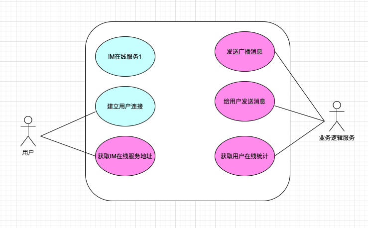
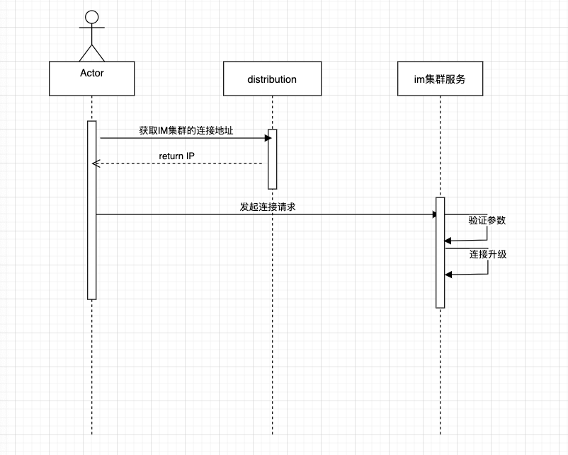

# distribution
distribution 是对于im的管理组件，应对公司快速发展的业务，单机的IM系统已经不能满足正常业务需求，需要引入一个管理组件对IM进行集群化处理，这个
im管理组件就是这个distribution项目

## 目录
- [背景](##背景)
- [整体结构](##整体结构)
    - [用例图](###用例图)
    - [时序图](###时序图)

## 背景
随着公司业务发展过程中，在线用户人数不断攀升，单机扩容已经很多次了，单节点不可避免的会带来宕机风险，如果存在宕机整体用户体验就十分糟糕。在这个过程
中我们迫切需要找到一个管理组件，对IM这种分散的组件进行统一管理，包括但不限于：用户在线、整体广播、im服务健康监测等等相关需求。所以就产生了我们看到
的项目：distribution ，意味着分布，管理IM的分布

### 整体结构
可以从我们目前的UML 来看看整个IM分布式通讯系统的整体结构，便于你更好理解使用我们的架构

##### 用例图
下面存在四种角色
- 用户 ： 就是普通的c端用户，需要在管理服务器获取到IM服务器地址并发起连接
- 业务逻辑服务： 所有发送的消息需要通过使用者的业务逻辑调用distribution的RPC接口进行下发
- 蓝色服务框：IM在线服务，维护用户的IM在线，具体可参看另外一个im仓库
- 红色服务框：distribution 管理服务，对im节点的所有通知操作和查询都是通过本服务来进行的

需求解读，用户阶段： 
- 1.用户创建连接是通过distribution 进行询问IM服务地址

在线服务节点：
- 1.节点需要加入IM集群，需要创建tcp/grpc 连接，做心跳
- 2.distribution 需要管理IM，所以需要与Im节点创建连接，做健康监测

distribution 节点：
- 1.快速判断用户在线： Online(token )
- 2.在线管理服务需要支持发送广播消息 ：broadcast(content []byte)
- 3.在线管理服务需要支持发送对点消息 ：sendMessage(content []byte,tokens...string )
- 4.在线管理服务需要支持获取IM节点： sendMessage(content []byte,tokens...string )

### 时序图

##### 用户时序图

- 用户上线需要先从distribution 中获取im集群的链接地址
- 用户对集群中某一台机器发起连接请求

##### IM时序图